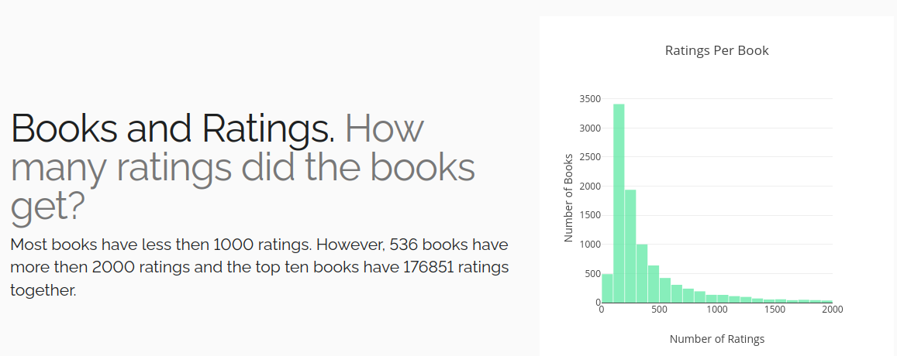
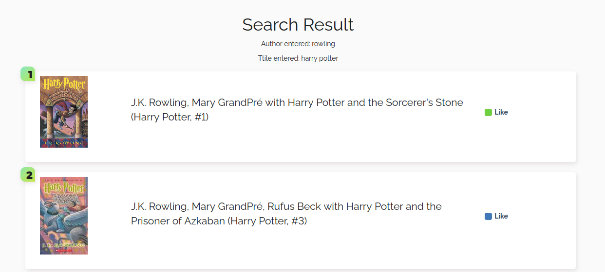
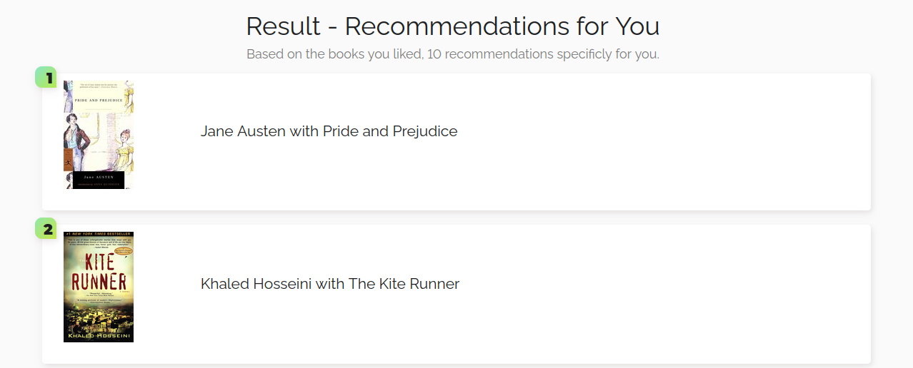

# book-recommendation-engine

### Table of Contents

1. [Installation and Instructions](#installation)
2. [Project Motivation](#motivation)
3. [File Descriptions](#files)
4. [Results](#results)
5. [Licensing](#licensing)

## Installation and Instructions

### Installation

You will need the standard data science libraries found in the Anaconda distribution of Python. Especially, the following packages are required:

- NumPy
- Pandas
- Matplotlib
- Plotly
- Pytest
- Seaborn
- Flask

Alternatively, you can directly install them with `pip install -r requirements.txt`. The code should run with no issues using Python versions 3.8.* or higher.

### Instructions

1. Run the following command in the project's root directory to launch the webapp.
    `python book_app.py`

2. Go to http://0.0.0.0:3001/ 

    - You see the main page of the webapp. Here you can understand the data, find books and get your own recommendations.

## Project Motivation

This project shall be a prototype for a book recommendation engine that allows an interaction of the user with the database to get personalized recommendations. Finding the next interesting book can become a challenge and recommendation engines support the user to find the right book. The user based implemented approach recommends books based on the users from the dataset who are most similar and books they liked and the user has not read yet.

## File Descriptions 

The most important files in this repository:

* `book_app.py` - This python file hosts the webapp via flask.

* `data_inspection.ipynb` - Jupyter notebook for initial data inspection.

* `collaborative_filtering.ipynb` - Jupyter notebook for initial recommendation engine development.

* `filtering/common.py` - Contains common python functions that can be used independent of the concrete filtering method.

* `filtering/collaborative_filtering.py` - The core of the recommendation system is contained in this python file.

* `filtering/wrangle_data.py` - Creates the plotly visualizations of the webapp.

* `data/books.csv` - Csv-file with books and meta data.

* `data/ratings.csv` - Csv-file with all ratings from the users for the books.

* `book_app/routes.py` - Defines the routes for the flask app and renders the html files.

* `book_app/templates/` - Contains the html files of the webapp.

* `book_app/static/img/` - Contains images used in the webapp.

* `book_app/static/styles` - Contains css-files to format the style of the webpages.

## Results

The webapp offers the possibility to understand the data (distribution of ratings per book and user, histogram of ratings), inspect the most popular books from the dataset and find books by author and/or title. Additionally, you can like books from the search and be used to get your own recommendations. The likes are stored over different sessions because they are stored in the cookies.

### Screenshots

## Licensing
  
The data was prepared and uploaded by [zygmuntz](https://github.com/zygmuntz/goodbooks-10k/) to github.